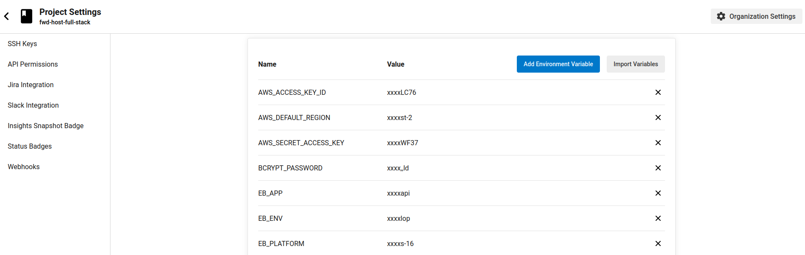

# Hosting a Full-Stack Application

## Installation

Provision the necessary AWS services needed for running the application:

1. In AWS, provision a publicly available RDS database running Postgres.
1. In AWS, provision a s3 bucket for hosting the uploaded files.
1. Export the ENV variables needed or use a package like [dotnev](https://www.npmjs.com/package/dotenv).
1. From the root of the repo, navigate server folder `cd server` to install the node_modules `npm install`. After installation is done start the api in dev mode with `npm run start`.
1. Without closing the terminal in step 1, navigate to the frontend `cd client` to intall the node_modules `npm install`. After installation is done start the api in dev mode with `npm run start`.

## Testing

This project contains two different test suite: unit tests and End-To-End tests(e2e). Follow these steps to run the tests.

1. `cd client`
1. `npm run test`

There are no Unit test on the back-end

### Unit Tests

Unit tests are using the Jasmine Framework.

### Links

[Front-End s3 link](https://fwd-full-stack-client.s3.us-west-2.amazonaws.com/index.html)
[Back-End Elasticbeanstalk link](develop.eba-7k5tfh3w.us-west-2.elasticbeanstalk.com/api)

### Circle-CI secrets

